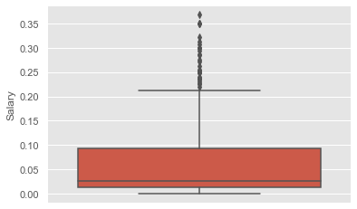
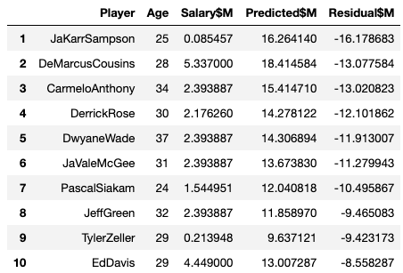

# Moneyball in NBA: Predicting NBA player salary

## Table of Contents
1. [Introduction](#introduction)
    - [Background](#background)
    - [Data](#data)
        - [Web scrapping](#web-scrapping)
        - [Joining datasets and cleaning](#Joining-datasets-and-cleaning)

2. [Exploratory Data Analysis](#exploratory-data-analysis)
    - [Average Salary Overtime](#average-salary-overtime)
    - [Feature Engineering](#feature-engineering)
    - [Salary Distribution](#salary-distribution)
    - [Correlation](#correlation)

3. [Prediction](#prediction)
    - [Baseline Model](#baseline-model)
    - [Model Selection](#model-selection)
    - [Feature Selection](#feature-selection)
    - [Dataset Selection](#dataset-selection)
    - [Hyperparameter Tuning](#hyperparameter-tuning)
    - [Evaluation](#evaluation)
    - [Underrated & Overrated Players](#underrated-&-overrated-players)
4. [Future works](#future-works)
    - [More feature engineering](#more-feature-engineering)
    - [Nice to have](#nice-to-have)

- [Built with](#built-with)
- [Author](#author)

---

## Introduction

### Background
I've been playing basketball for more than 20 years and it's one of my favorite things to do in my free time. I've been a fan of the NBA since the 90's and basketball is my favorite sport to watch.

Basketball has many different stats that measure player's performance. I was curious if I can predict the salary of the NBA players based on their stats. If I can precisely predict the salary, I can give recommendations to teams to recruit the "undervalued players" like in the movie, Moneyball, to maximize their return on investments.

### Data

#### Web scrapping

I've scraped my dataset from 2 websites using Python's BeautifulSoup library.

- https://www.basketball-reference.com (For stats)
- https://hoopshype.com/salaries (For salary)

Basketball reference had statistics of every NBA player in a given year. There were 28 different features that included, points per game, games played, position, age, field goal percentage, and etc.

Hoopshype had a table of every NBA player's salary in a given year. 

I've also extracted the salary cap of each year from basketball reference's [page](https://www.basketball-reference.com/contracts/salary-cap-history.html). Salary cap is the amount of money each team can spend on their entire roster for that given year.

You can find the code I used for web scrapping [here](1.&#32;Data&#32;generation&#32;(Webscrapping).ipynb).  

#### Joining datasets and cleaning

I've joined the 2 datasets on the player's name. 

In order to join properly, I've cleaned the names from both sources so that it would be as consistent as possible (So that it would join as much as possible)

Some steps I took to clean the names:
- Converted special characters to normal english characters. (Eg. 'Žižić' to 'Zizic')
- Removed: 
    - 'Jr.'
    - 'III'
    - periods
    - spaces
    - '*' (labeled for hall of fame players in basketball reference)

However, since the 2 sources had different names for some players, (Eg. Lou Williams vs Louis Williams) I couldn't join all players. 

On the training set, 370 players (4.2% of data) failed to join. I've decided to drop them from my training model.

On the test set, I had 12 players (2.3% of data) that failed to join. Since the count was low, I've decided to manually input the salary so I can predict all the players in the test set.

I've created an `id` column with '`Player name` + `year`' for each entry.

All the columns in my dataset were strings so I converted them to number format. For `Salary` and `SalaryCap`, I had to replace the commas and dollar sign to convert to numbers. 

Some players were registered for multiple positions (Eg. SF-SG, PG-SG, etc.). I converted them to their primary position which was the first entry (Eg. If 'SF-SG', the primary position is 'SF').

I've ended up with 9310 rows and 33 columns after cleaning my dataset.
- **Train Set: 2000-2018 Seasons (8780 rows, 33 columns)**
- **Test Set: 2019 Season (530 rows, 33 columns)**

---

## Exploratory Data Analysis

### Average Salary Overtime

While exploring the data, I quickly realized that the average salary and the salary cap had been steadily increasing over time. I observed a huge increase in salary cap in 2017 when the NBA decided to increase the salary cap from about $70M to $94M. This was the year when the Golden State Warriors were able to [acquire Kevin Durant](https://www.espn.com/nba/story/_/id/16759826/kevin-durant-announces-sign-golden-state-warriors) in free agency with the additional cap space. 

This could have an effect in my prediction if I don't make any adjustments. 

### Feature Engineering

I decided to normalize my salary so that it would be based off of the percentage of that year's salary cap. After normalization, the salary resembled more of a uniform distribution.

### Salary Distribution

I plotted the normalized salary distribution, but I couldn't observe any anomalies for each year. A large portion of the player's salary was in between 0.0 and 0.1 of the salary cap.

### Correlation

I checked which variables had a positive correlation to salary using Pearson's method. The results are shown below indicating field goals per game as the highest correlation. Many of the positive correlations were related to scoring. I can keep these in my mind when I conduct feature selections on my predictions.

**Correlation with >= 0.5**

| Positive                             | Correlation |
| ------------------------------------ | ----------- |
| Field Goals Per Game                 | 0.61        |
| Points Per Game                      | 0.60        |
| 2-Point Field Goals Per Game         | 0.60        |
| 2-Point Field Goal Attempts Per Game | 0.60        |
| Field Goal Attempts Per Game         | 0.59        |
| Minutes Played Per Game              | 0.58        |
| Free Throw Attempts Per Game         | 0.58        |
| Free Throws Per Game                 | 0.57        |
| Defensive Rebounds Per Game          | 0.56        |
| Turnovers Per Game                   | 0.55        |
| Games Started                        | 0.52        |
| Total Rebounds Per Game              | 0.52        |

---

## Prediction

I scored my predictions based on root mean squared error (RMSE). 

### Baseline Model

I started off my prediction with a baseline model using the average salary from my training set (2000-2018 seasons) to predict every player's 2019  NBA salary. With this baseline model, I got a RMSE of **0.0784**. 

The salary cap for the 2019 season was $101.9M so this RMSE would be equivalent to about $8M in error per prediction.

Based on the residual plot, I was overpredicting many of the low paid players by 0.08 and underpredicting the top players. This does align with the distribution of the player's salary.

### Model Selection

My first step in improving the RMSE was choosing the prediction model. I've tested using all variables with default parameters for 5 different models; Linear Regression, Random Forest, Gradient Boosting, Ada Boost, and XG Boost. 

I decided to proceed with Gradient Boosting since it consistently performed the best out of the 5 with a RMSE of **0.04681**. 

### Feature Selection

For feature selection, I tested out various combinations based on the feature importance. After many trials and errors (testing with positive correlation features as well), my predictions were consistently performing the best with 6 features; Age, games played, total rebounds per game, minutes played per game, free throw attempts per game, and year. 

I decided to proceed with these 6 variables that lowered my RMSE to **0.04653**.

### Dataset Selection

After selecting my features, I trained my prediction using different numbers of years. My initial train data used all of the last 19 years worth of data, so I tested my prediction by training with more recent years. 
After testing with different sets of years, I found out that using the dataset from the last 10 years was consistently predicting the best with an RMSE of **0.04614**. 

This shows that the older seasons were not as relevant since the proportion of player's salary to the salary cap was higher. The RMSE decreased when I trained on datasets that were less than 10 years and this could be because there was not enough data to train on. It seemed like the sweet spot was using the last 10 years so I decided to proceed with this dataset.

### Hyperparameter Tuning
I've used Sklearn's GridSearch library to find the best hyperparameters.
After multiple iterations, I got a RMSE of **0.04603** using the following parameters.

- 'learning_rate': 0.1 
- 'max_depth': 3 
- 'min_samples_leaf': 2 
- 'min_samples_split': 8 
- 'n_estimators': 75

### Evaluation

My best score with RMSE of **0.04603** in dollars is equivalent to $4.7M in error per prediction. My baseline model was $8M (RMSE 0.0784) in error per prediction so I was able to improve by $3.3M. 

You can see that my residual plot improved from the baseline model.

However, my RMSE of 0.04603 still has a high error rate since the mean salary for 2019 was 0.06398. This makes my error rate to roughly 72% of the average salary so there is more room for improvement.

| 2019 Salary Distribution  | Value   |
| ------------------------- | ------- |
| Count                     | 530     |
| Mean                      | 0.06398 |
| Standard Deviation        | 0.07724 |
| Min                       | 0.00046 |
| 25%                       | 0.01353 |
| 50%                       | 0.02706 |
| 75%                       | 0.09346 |
| Max                       | 0.3677  |

### Underrated & Overrated Players

Here are the top 10 most underrated and overrated players based on my model.

**Top 10 Underrated**

**Top 10 Overrated**

---

## Future works

### More feature engineering

For my future works, I can definitely do more feature engineering. 

A suggestion I have is to use absolute numbers instead of average numbers. Since most of my player's stats were based on per game averages, my model overpredicted on players who performed well in a very low number of games. For example, JaKarr Sampson and Tyler Zeller played less than 7 games in 2019, but they were in my top 10 most underrated player's list.

I would also want to consider adjustments on the salary cap spike in 2017. When the league increased the salary cap by more than $20M in a year, it lowered the average salary on my model which was based on the percentage of salary cap. 

### Nice to have

Some nice to have in my model would be labeled data for "Rookie Contract" and "Injury". 

Andrew Wiggins, Nikola Jokic, and Jabari Parker were all highly overrated in my prediction because my model thought they were in their [rookie contract](https://www.si.com/nba/2018/06/22/rookie-pay-scale-how-much-money-they-make-pick) based on their age.

Demarcus Cousins and Derrick Rose were highly underrated in my prediction because my model couldn't identify that they had significant injuries in their careers that would lower their salary significantly. 

I believe that having these additional features would increase my prediction in my future work.

---

## Built With

* **Software Packages:**  [Python](https://www.python.org/),  [Pandas](https://pandas.pydata.org/docs/), [Numpy](https://numpy.org/), [Scikit-Learn](https://scikit-learn.org/), [Matplotlib](https://matplotlib.org/), [Scipy](https://docs.scipy.org/doc/), [Seaborn](https://seaborn.pydata.org/)
* **Prediction Methods:** Gradient Boosting, Random Forest, XGBoost, Ada Boost, Random Forest.
## Author

* **Takeshi Sugiyama** - *Data Scientist*
  * [Linkedin](https://www.linkedin.com/in/takeshi-sugiyama/)
  * [Tableau](https://public.tableau.com/profile/takeshi.sugiyama)
